# Architecture

This document describes the architecture of the ChRIS Streaming Workers system as implemented in this repository.

## System diagram

```mermaid
flowchart LR

%% =========================
%% SOURCES
%% =========================
subgraph S["Compute Runtime"]
    K8S["Kubernetes Jobs / Pods"]
    DCKR["Docker Containers"]
end

%% =========================
%% JOB CONTROL PLANE
%% =========================
subgraph P["Job Control Plane"]
    PFCON["pfcon<br/>(job submission, data, deletion)"]
end

%% =========================
%% EVENT PIPELINE
%% =========================
subgraph E["Event Pipeline"]
    EF["Event Forwarder<br/><i>async Docker/K8s watcher</i>"]
    RS1[("Redis Streams: stream:job-status:{0..N-1}<br/><small>sharded by md5(job_id) · AOF everysec · MAXLEN~ trim</small>")]
    ST["Status Consumer<br/><small>lease-based shard owner</small>"]
    PG[("PostgreSQL")]
    CQ["Celery Task Queue<br/><small>(Redis broker)</small>"]
    CW["Celery Worker<br/><small>process_job_status + workflow orchestration</small>"]
end

%% =========================
%% LOG PIPELINE
%% =========================
subgraph L["Log Pipeline"]
    LS["Log Forwarder<br/><i>aiodocker / kubernetes-asyncio tailer</i>"]
    RS2[("Redis Streams: stream:job-logs:{0..N-1}<br/><small>sharded by md5(job_id) · AOF everysec · MAXLEN~ trim</small>")]
    LC["Log Consumer<br/><small>group-based shard sweep</small>"]
    QW[("Quickwit")]
end

%% =========================
%% WORKFLOW PIPELINE
%% =========================
subgraph W["Workflow Pipeline"]
    RS3[("Redis Streams: stream:job-workflow:{0..N-1}<br/><small>sharded by md5(job_id) · AOF everysec · MAXLEN~ trim</small>")]
    WFT[("PostgreSQL<br/>job_workflow_events")]
end

%% =========================
%% REAL-TIME STREAMING LAYER
%% =========================
subgraph R["Real-time Streaming Layer"]
    SSE["SSE Service<br/><small>FastAPI + sse-starlette<br/>StreamDispatcher (ungrouped XREAD)</small>"]
    UI["Test UI<br/><small>nginx + EventSource</small>"]
end

%% =========================
%% PFCON submits jobs to the runtime
%% =========================
PFCON -- "schedule /<br>delete" --> DCKR
PFCON -. "schedule /<br>delete" .-> K8S

%% =========================
%% EVENT FLOWS
%% =========================
DCKR -- "container events<br/>(create/start/die)" --> EF
K8S -. "Job watch API<br/>(ADDED/MODIFIED)" .-> EF
EF -- "XADD StatusEvent" --> RS1
RS1 -- "XREADGROUP" --> ST
ST -- "all events" --> CQ
CQ --> CW
CW -- "upsert" --> PG
CW -- "XADD confirmed_*<br/>back to status stream" --> RS1
CW -- "workflow step<br/>advancement" --> PFCON

%% =========================
%% LOG FLOWS
%% =========================
DCKR -- "docker log API<br/>(stdout/stderr tail)" --> LS
K8S -. "pod log API<br/>(stdout/stderr tail)" .-> LS
LS -- "XADD LogEvent<br/>(+ eos=true on EOF)" --> RS2
RS2 -- "XREADGROUP" --> LC
LC -- "ingest (commit=force)" --> QW
LC -. "SET logs_flushed<br/>(after flush, on EOS)" .-> RS1

%% =========================
%% WORKFLOW FLOWS
%% =========================
CW -- "INSERT job_workflow_events" --> WFT
CW -- "XADD WorkflowEvent" --> RS3

%% =========================
%% REAL-TIME FLOWS
%% =========================
RS1 -. "ungrouped XREAD" .-> SSE
RS2 -. "ungrouped XREAD" .-> SSE
RS3 -. "ungrouped XREAD" .-> SSE
SSE -- "SSE<br/>EventSource" --> UI
UI -- "POST /api/jobs/{id}/run" --> SSE

%% =========================
%% HISTORY QUERY + REPLAY
%% =========================
SSE -. "historical replay<br/>(on SSE connect)" .-> PG
SSE -. "historical replay<br/>(on SSE connect)" .-> QW
SSE -. "historical replay<br/>(on SSE connect)" .-> WFT

%% =========================
%% STYLING
%% =========================
classDef worker fill:#0f3460,stroke:#e94560,color:#fff
classDef infra fill:#16213e,stroke:#3b82f6,color:#eee
classDef runtime fill:#1a1a2e,stroke:#4ade80,color:#eee
classDef ui fill:#16213e,stroke:#fbbf24,color:#eee

class EF,ST,LC,LS worker
class RS1,RS2,RS3,PG,QW,WFT,CQ,CW infra
class K8S,DCKR,PFCON runtime
class SSE,UI ui
```



## Data flow summary

### Event pipeline (status changes)

1. **pfcon** schedules containers on Docker or Kubernetes with a role label and a job-type label. The label key differs per runtime:
   - Docker: `org.chrisproject.miniChRIS=plugininstance` and `org.chrisproject.job_type={copy|plugin|upload|delete}`
   - Kubernetes: `chrisproject.org/role=plugininstance` and `chrisproject.org/job-type={copy|plugin|upload|delete}` (K8s-idiomatic `domain/key` format, set via pfcon's `JOB_LABELS` env)
2. **Event Forwarder** watches the Docker daemon event stream (or K8s Job watch API), filtering by label.
   - On startup, lists all matching containers and emits their current state (restart-safe).
   - Maps native Docker states to pfcon's `JobStatus` enum using the same logic as `pfcon/compute/dockermgr.py:_get_status_from()`.
   - `XADD`s `StatusEvent` payloads to the sharded Redis stream `stream:job-status:{shard}`, where `shard = md5(job_id) mod N` (stable — the same `job_id` always lands on the same shard).
   - Writes use `MAXLEN ~ <cap>` approximate trimming to bound stream growth.
   - In-memory LRU deduplication suppresses re-emitting identical states.
3. **Status Consumer** reads from the sharded status streams using `XREADGROUP`:
   - Each replica acquires a **lease** (Redis `SET NX PX` with heartbeat refresh) for a subset of shards, making each shard a single-writer for ordering.
   - On successful handling, calls `XACK`. A `PendingReclaimer` background task uses `XAUTOCLAIM`/`XPENDING` to recover entries left in the PEL by crashed consumers, and routes messages that exceed `reclaim_max_deliveries` to `stream:job-status-dlq`.
   - Schedules a **Celery task** `process_job_status` for every event. The consumer has no direct Redis key-space or PostgreSQL dependency — all persistence and publishing is delegated to the Celery Worker.
4. **Celery Worker** picks up every `process_job_status` task:
   - Upserts to **PostgreSQL** (`ON CONFLICT DO UPDATE` with timestamp guard — idempotent and order-safe).
   - For terminal statuses (`finishedSuccessfully`, `finishedWithError`, `undefined`), `XADD`s a `confirmed_*` status event **back onto the same `stream:job-status:{shard}` stream** so SSE clients and CUBE see the confirmation. The Status Consumer drops `confirmed_*` entries on re-entry to avoid a processing loop.
   - For terminal statuses, checks if an active workflow exists and advances to the next step (see Workflow Orchestration below).

### Log pipeline (container output)

1. **Log Forwarder** (Python) tails container stdout/stderr directly from the compute runtime:
   - In Docker mode, it uses `aiodocker` to attach to each matching container's log stream.
   - In Kubernetes mode, it uses `kubernetes-asyncio` to follow pod logs.
   - Filters by the same label selector as the Event Forwarder (`org.chrisproject.miniChRIS=plugininstance` on Docker, `chrisproject.org/role=plugininstance` on Kubernetes) so only ChRIS job containers are tailed.
   - Extracts `job_id` + `job_type` from labels and reshapes each line to the `LogEvent` schema.
   - `XADD`s each line to the sharded Redis stream `stream:job-logs:{shard}` keyed by the same `md5(job_id) mod N` hash, so a job's logs and status events share a shard ordering key.
   - When the container's log stream closes (container exited and buffered output drained), emits a final `LogEvent` with `eos=true` on the same shard. EOS is sourced from the same stream iterator that produced the lines, so no line can arrive after the EOS.
2. **Log Consumer** reads from the sharded log streams via `XREADGROUP` in configurable batches (default: 200 messages or 2 seconds):
   - Ingests to **Quickwit** via `POST /api/v1/{index}/ingest?commit=force` (NDJSON). The `commit=force` flag blocks until the documents are committed and searchable — ensuring the EOS / `logs_flushed` contract holds.
   - `XACK`s messages only after a successful Quickwit ingest (at-least-once).
   - Messages that repeatedly fail and exceed `reclaim_max_deliveries` are routed by the `PendingReclaimer` to `stream:job-logs-dlq`. Unlike the Status Consumer there is no shard lease: every replica sweeps every shard, and the atomic `XCLAIM` prevents double-processing.
   - When an EOS marker is in the batch, SETs `job:{job_id}:{job_type}:logs_flushed` with 1-hour TTL **after** the Quickwit write succeeds (so the key cannot fire ahead of the data it attests to). If the write fails, the EOS stays pending and is retried.
   - SSE fan-out of log lines does **not** go through the Log Consumer — the SSE service runs its own ungrouped `XREAD` on `stream:job-logs:*` and sees every entry independently.

### Real-time streaming layer

1. **SSE Service** (FastAPI) exposes SSE and REST endpoints. A single process-wide `StreamDispatcher` runs one ungrouped `XREAD` loop per base stream (`stream:job-status`, `stream:job-logs`, `stream:job-workflow`) across every shard and fans entries out to per-subscriber `asyncio.Queue`s by `job_id`:
   - `GET /events/{job_id}/status` — subscribes to status entries for this job, streams as SSE with historical replay from PostgreSQL.
   - `GET /events/{job_id}/logs` — subscribes to log entries for this job, streams as SSE with historical replay from Quickwit.
   - `GET /events/{job_id}/workflow` — subscribes to workflow transitions for this job, streams as SSE with historical replay from `job_workflow_events`.
   - `GET /events/{job_id}/all` — subscribes to all three streams with full historical replay.
   - `GET /logs/{job_id}/history` — queries Quickwit for historical logs (JSON).
   - `POST /api/jobs/{job_id}/run` — submits a workflow via Celery (202 Accepted).
   - `GET /api/jobs/{job_id}/workflow` — queries workflow state (current step, status).
   - `GET /api/jobs/{job_id}/status/history` — queries all status records for a job.
   - `GET /metrics` — snapshot of per-shard `XLEN`, PEL depth, and DLQ length for all three pipelines. Used by smoke tests and operational dashboards.
2. **Historical replay**: When an SSE client connects, the service first registers the subscriber with the `StreamDispatcher` (to start buffering live entries into the subscriber's queue), then replays historical events from PostgreSQL (statuses + workflow) and Quickwit (logs). Events are deduplicated by `event_id` to prevent duplicates between historical and live data.
3. **Test UI** (nginx + vanilla JS) proxies to the SSE service. The browser submits workflows via `POST /sse/api/jobs/{id}/run` and uses `EventSource` to subscribe to SSE streams. All workflow orchestration happens server-side.

### Workflow orchestration

The Celery Worker implements an event-driven workflow state machine that orchestrates the full job lifecycle:

```
copy → plugin → upload → delete → cleanup → completed
```

The `copy` and `upload` steps are **optional** — at workflow start the Celery Worker GETs pfcon's server configuration from `/api/v1/pluginjobs/` and reads `requires_copy_job` and `requires_upload_job`. Any optional step whose flag is `false` is skipped entirely (no pfcon call, no container, no wait for a status event). For fslink mode this typically skips `upload`; for other storage backends both may run.

1. **UI** submits a `POST /api/jobs/{job_id}/run` request to the SSE Service.
2. **SSE Service** schedules a `start_workflow` Celery task.
3. **Celery Worker** (`start_workflow`):
   - Calls `PfconClient.get_server_info()` (cached per process) to read the `requires_*_job` flags.
   - Folds the flags into the workflow `params`, which are persisted in JSONB so subsequent step advancement can honour them without re-hitting pfcon.
   - Inserts a `job_workflow` row with `current_step` set to the **first active step** (e.g., `plugin` if copy is not required) and `status='running'`.
   - Calls pfcon to schedule the first active step.
4. **Celery Worker** (`process_job_status`) — on each terminal status event:
   - Checks if an active workflow exists for this `job_id`.
   - If the terminal event matches the current step's `job_type`, computes the next active step via `_next_active_step()` (which skips optional steps based on the persisted flags).
   - Step advancement is atomic: `UPDATE job_workflow SET current_step = next WHERE current_step = current` (idempotent via rowcount check).
   - Calls pfcon to schedule the next job.
   - If pfcon returns an immediate completion (e.g., `uploadSkipped` in fslink mode), advances again without waiting for a Docker event.
5. **Failure handling**: If any step fails (copy, plugin, upload), or if the pfcon call itself raises, the workflow skips directly to `delete` for cleanup. The terminal workflow status is not decided mid-flight; `status` stays `running` until cleanup completes.
6. **Cleanup** (`cleanup_containers`):
   - Waits for `logs_flushed` Redis keys for all job types that have a `job_status` row. Missing keys are tolerated if the step's terminal status has been stable in `job_status` for at least `eos_quiescence_seconds` (the EOS backstop — see the EOS section).
   - Retries every 2 seconds, up to 60 seconds (safety valve).
   - Calls pfcon `DELETE` for each container type.
   - **Computes the terminal workflow status** from the per-step outcomes recorded in `job_status`:
     - All required non-plugin steps (copy if required, upload if required, delete) must be `finishedSuccessfully`.
     - If plugin is `finishedSuccessfully` → workflow `status = finishedSuccessfully`.
     - If plugin is `finishedWithError` → workflow `status = finishedWithError` (a clean non-zero exit of the plugin container is a legitimate run outcome, not a workflow failure).
     - Otherwise (any required step missing or non-success, or plugin in another state like `undefined`) → workflow `status = failed`.
   - Updates `job_workflow.status` with the terminal value, inserts the final row into `job_workflow_events`, and XADDs the final `WorkflowEvent` onto `stream:job-workflow:{shard}`.

#### Workflow event shape

Every entry on `stream:job-workflow:{shard}` (and every `job_workflow_events` row) carries:

| Field | Description |
|-------|-------------|
| `job_id` | pfcon job identifier |
| `current_step` | the step the workflow is now sitting in (`copy`, `plugin`, `upload`, `delete`, `cleanup`, or `completed`) |
| `current_step_status` | the status of that current step (e.g. `started`, `finishedSuccessfully`, `finishedWithError`) |
| `workflow_status` | overall workflow status: `running` while in motion, or one of `finishedSuccessfully`, `finishedWithError`, `failed` once cleanup has completed |
| `error` | (optional) error string present when a step fails synchronously during scheduling |

### EOS (End-of-Stream) mechanism

The EOS mechanism is the **fast path** for knowing when a container's logs have been durably stored. It is a hint, not the correctness signal — a `eos_quiescence_seconds` backstop in `cleanup_containers` guarantees forward progress if the hint is missed.

1. The **Log Forwarder** owns EOS emission because it is the only component that observes the true signal: the container's log stream EOF. In Docker mode this is when aiodocker's `container.log(follow=True)` iterator returns on both stdout and stderr; in Kubernetes mode it is when `read_namespaced_pod_log(follow=True)` drains. Both end only after the container has exited *and* all buffered output has been flushed by the runtime.
2. When the stream closes cleanly, the Log Forwarder `XADD`s a final `LogEvent` with `eos=true` on the **same shard** as the preceding log lines (same `job_id`). Because both the log lines and the EOS marker come from the same in-process async iterator and the same `asyncio.Queue`, no line can possibly arrive after the EOS. This is the correctness difference from the old design: there is no timing-based delay to tune.
3. The **Log Consumer** drains EOS markers with the regular batch. After the batch's Quickwit ingest (`commit=force`) succeeds, it SETs `job:{job_id}:{job_type}:logs_flushed` (TTL 3600s) for each EOS in the batch, then XACKs. The SET is gated on the flush success so the key only appears once the logs it attests to are durable in Quickwit. If the write fails, the EOS stays in the PEL and is retried — no premature signal.
4. The **Celery Worker**'s `cleanup_containers` task uses the Redis key as a fast path. If the key is missing, it falls back to a **terminal-status quiescence** check: once a step's terminal status has been recorded in `job_status` for at least `eos_quiescence_seconds` (default 10s), the logs are treated as drained and cleanup proceeds. This guarantees cleanup never blocks forever on a missing EOS — e.g., Log Forwarder crash on container exit, or a container whose log stream closes abnormally.
5. For steps that complete immediately without creating containers (e.g., upload when `requires_upload_job=false`, or on pfcon scheduling failure), the `logs_flushed` key is set immediately by the Celery Worker.

## Message schemas

### StatusEvent (stream: `stream:job-status:{shard}`)

Mirrors pfcon's `JobInfo` dataclass from `pfcon/compute/abstractmgr.py`.

| Field | Type | Description |
|-------|------|-------------|
| `event_id` | `str` | Deterministic SHA-256 hash for deduplication |
| `job_id` | `str` | pfcon job identifier (e.g. `chris-jid-42`) |
| `job_type` | `enum` | `plugin`, `copy`, `upload`, or `delete` |
| `status` | `enum` | `notStarted`, `started`, `finishedSuccessfully`, `finishedWithError`, `undefined`, or `confirmed_*` variants |
| `previous_status` | `enum?` | Previous status (for transition detection) |
| `image` | `str` | Container image (e.g. `fnndsc/pl-simpledsapp`) |
| `cmd` | `str` | Container command |
| `message` | `str` | Native status string (e.g. `exited`) |
| `exit_code` | `int?` | Container exit code (`null` while running) |
| `timestamp` | `datetime` | ISO 8601 UTC |
| `source` | `str` | `docker` or `kubernetes` |

### LogEvent (stream: `stream:job-logs:{shard}`)

| Field | Type | Description |
|-------|------|-------------|
| `event_id` | `str` | Deterministic SHA-256 hash derived from `(job_id, job_type, container_name, stream, timestamp, line)` — used to dedupe replayed history against live stream entries |
| `job_id` | `str` | pfcon job identifier |
| `job_type` | `enum` | `plugin`, `copy`, `upload`, or `delete` |
| `container_name` | `str` | Docker container name |
| `line` | `str` | Single log line (empty for EOS markers) |
| `stream` | `str` | `stdout` or `stderr` |
| `eos` | `bool` | End-of-Stream marker (default `false`). When `true`, signals all logs for this container have been flushed. |
| `timestamp` | `datetime` | ISO 8601 UTC |

## Redis Streams design

All events for a single job share one shard, guaranteeing ordering per job. Shard selection is a **stable hash**: `shard = int.from_bytes(md5(job_id).digest()[:4], "big") mod stream_num_shards`. This is the same `ShardRouter` used by the producers (Event Forwarder, Log Forwarder) and the consumers (Status Consumer, Log Consumer).

| Stream base | Shards | Trim policy | Writers | Readers |
|-------------|--------|-------------|---------|---------|
| `stream:job-status:{shard}` | `stream_num_shards` (default 8) | `MAXLEN ~ stream_status_maxlen` (default 1M) | `event-forwarder` | `status-consumer` |
| `stream:job-logs:{shard}` | `stream_num_shards` (default 8) | `MAXLEN ~ stream_logs_maxlen` (default 5M) | `log-forwarder` (log lines + EOS markers) | `log-consumer` |
| `stream:job-status-dlq` | 1 | `MAXLEN ~ stream_dlq_maxlen` (default 100k) | `status-consumer` (via reclaimer) | (manual inspection) |
| `stream:job-logs-dlq` | 1 | `MAXLEN ~ stream_dlq_maxlen` (default 100k) | `log-consumer` (via reclaimer) | (manual inspection) |

Consumer groups (`status-consumer-group`, `log-consumer-group`) are created on startup with `MKSTREAM`. Each replica acquires a **shard lease** (`SET NX PX` on `lease:<stream>:<group>` with periodic refresh) so only one replica reads any given shard at a time — that is what makes `XREADGROUP + XACK` safe as a single-writer ordering primitive per job.

The `PendingReclaimer` periodically scans `XPENDING` for entries older than `reclaim_min_idle_ms` on shards owned by this replica and uses `XAUTOCLAIM` to resume them. After `reclaim_max_deliveries` attempts, messages are `XADD`ed to the DLQ and `XACK`ed off the live stream.

## Resilience properties

| Property | Event Forwarder | Log Forwarder | Status Consumer | Log Consumer |
|----------|----------------|-------------|-----------------|--------------|
| Stateless | Yes — no local state | Yes — no local state | Yes — state in Celery/PostgreSQL | Yes — state in Quickwit |
| Restart-safe | Re-lists all containers on startup | Re-attaches to running container log streams | Resumes from PEL via `XAUTOCLAIM` | Resumes from PEL via `XAUTOCLAIM` |
| Reconnects | Exponential backoff on Docker/K8s stream disconnect | Exponential backoff on docker/k8s log stream disconnect | `redis-py` async reconnect | `redis-py` async reconnect |
| Dedup | Deterministic `event_id` + LRU cache | Deterministic `event_id` per line | PostgreSQL `ON CONFLICT` upsert (via Celery Worker) | Quickwit document indexing |
| Backpressure | Bounded streams via `MAXLEN ~` | Bounded streams via `MAXLEN ~` | Per-shard batch reads with explicit `XACK` | Batched processing with configurable flush |
| Dead letters | — | — | `stream:job-status-dlq` after N deliveries | `stream:job-logs-dlq` after N deliveries |
| Horizontal scale | Docker: single writer (one replica by design). Kubernetes: 2 replicas with `coordination.k8s.io` Lease — only the leader emits; follower takes over on leader failure. | Docker: single forwarder. Kubernetes: 2 replicas with the same `coordination.k8s.io` Lease — only the leader tails logs and emits EOS markers. | Add replicas → each acquires a shard lease | Add replicas → each acquires a shard lease |

## Durability and HA

- **Single-node Redis** (default): `appendonly yes` + `appendfsync everysec` is configured everywhere Redis runs — the docker-compose `redis` service, `kubernetes/20-infra/redis.yaml`, and the integration-test Redis in `kubernetes/tests/integration-stack.yaml`. This bounds data loss to roughly one second of writes on an `fsync` gap.
- **Sentinel HA** (opt-in): `kubernetes/20-infra/redis-ha.yaml` ships a 3-node replicated Redis StatefulSet with a separate 3-node Sentinel StatefulSet. Workers opt in by setting `REDIS_URL=redis+sentinel://redis-sentinel:26379/mymaster/0`. The `create_redis_client()` factory in `chris_streaming/common/redis_stream.py` detects the `redis+sentinel://` scheme and resolves the current master via `redis.asyncio.sentinel.Sentinel`, so no client code changes are needed to switch between single-node and Sentinel deployments.

## Status processing flow

For every status event:

```
Status Consumer (shard owner)
  ├── XREADGROUP → PEL entry
  ├── Celery send_task("process_job_status")
  └── XACK on success
        │
        ▼
Celery Worker
  ├── Upsert PostgreSQL (with timestamp guard for ordering safety)
  ├── [terminal only] XADD confirmed_* onto stream:job-status:{shard}
  │   (Status Consumer drops confirmed_* on re-entry to avoid a loop)
  └── [terminal only] Check workflow and advance step
        │
        ├── [next step] Call pfcon to schedule next job
        │     └── [immediate completion] Advance again (no Docker event needed)
        └── [cleanup step] Schedule cleanup_containers task
              └── Wait for logs_flushed → DELETE containers → Mark completed
```

The Status Consumer is a pure "Redis Streams → Celery" bridge with no direct key-space or PostgreSQL dependency. The Celery Worker handles all persistence (PostgreSQL + `job_workflow_events`), terminal confirmation (`confirmed_*` XADD back to the status stream), workflow-transition emission (XADD on `stream:job-workflow:{shard}`), and workflow orchestration. SSE fan-out is not a Celery concern — the SSE service reads the same streams directly via ungrouped `XREAD`.

The `confirmed_` prefix separates "the remote compute reported this" from "our backend acknowledged it." This is the hook where CUBE's processing logic (file registration, feed updates) would execute in production.

The PostgreSQL upsert includes a `WHERE updated_at < EXCLUDED.updated_at` guard so that Celery tasks executing out of order cannot overwrite newer statuses with older ones.

Workflow step advancement uses an atomic `UPDATE ... WHERE current_step = X` query. If the rowcount is 0, another Celery worker already advanced this step (idempotent). This prevents duplicate pfcon calls even with Celery's at-least-once delivery.
