# Architecture

This document describes the architecture of the ChRIS Streaming Workers system as implemented in this repository.

## System diagram

```mermaid
flowchart LR

%% =========================
%% SOURCES
%% =========================
subgraph S["Compute Runtime"]
    K8S["Kubernetes Jobs / Pods"]
    DCKR["Docker Containers"]
end

%% =========================
%% JOB CONTROL PLANE
%% =========================
subgraph P["Job Control Plane"]
    PFCON["pfcon<br/>(job submission, data, deletion)"]
end

%% =========================
%% EVENT PIPELINE
%% =========================
subgraph E["Event Pipeline"]
    EF["Event Forwarder<br/><i>async Docker/K8s watcher</i>"]
    K1[("Kafka: job-status-events<br/><small>12 partitions · key=job_id · 3d retention</small>")]
    ST["Status Consumer"]
    PG[("PostgreSQL")]
    CQ["Celery Task Queue<br/><small>(Redis broker)</small>"]
    CW["Celery Worker<br/><small>process_job_status + workflow orchestration</small>"]
end

%% =========================
%% LOG PIPELINE
%% =========================
subgraph L["Log Pipeline"]
    FB["Fluent Bit<br/><i>Docker log agent + Lua filter</i>"]
    K2[("Kafka: job-logs<br/><small>12 partitions · key=job_id · 3d retention</small>")]
    LC["Log Consumer"]
    ES[("OpenSearch")]
end

%% =========================
%% REAL-TIME STREAMING LAYER
%% =========================
subgraph R["Real-time Streaming Layer"]
    RD[("Redis Pub/Sub<br/><small>job:{id}:status · job:{id}:logs</small>")]
    SSE["SSE Service<br/><small>FastAPI + sse-starlette</small>"]
    UI["Test UI<br/><small>nginx + EventSource</small>"]
end

%% =========================
%% PFCON submits jobs to the runtime
%% =========================
PFCON -- "schedule /<br>delete" --> DCKR
PFCON -. "schedule /<br>delete" .-> K8S

%% =========================
%% EVENT FLOWS
%% =========================
DCKR -- "container events<br/>(create/start/die)" --> EF
K8S -. "Job watch API<br/>(ADDED/MODIFIED)" .-> EF
EF -- "StatusEvent<br/>(SASL/PLAIN)" --> K1
EF -. "EOS marker<br/>(delayed)" .-> K2
K1 --> ST
ST -- "all events" --> CQ
CQ --> CW
CW -- "upsert" --> PG
CW -- "PUBLISH<br/>job:{id}:status" --> RD
CW -- "workflow step<br/>advancement" --> PFCON

%% =========================
%% LOG FLOWS
%% =========================
DCKR -- "container log files<br/>(/var/lib/docker/containers/)" --> FB
K8S -. "pod log files" .-> FB
FB -- "LogEvent<br/>(SASL/PLAIN)" --> K2
K2 --> LC
LC -- "bulk _bulk API" --> ES
LC -. "SET logs_flushed<br/>(on EOS)" .-> RD

%% =========================
%% REAL-TIME FLOWS
%% =========================
LC -- "PUBLISH<br/>job:{id}:logs" --> RD
RD -- "SUBSCRIBE" --> SSE
SSE -- "SSE<br/>EventSource" --> UI
UI -- "POST /api/jobs/{id}/run" --> SSE

%% =========================
%% HISTORY QUERY + REPLAY
%% =========================
SSE -. "historical replay<br/>(on SSE connect)" .-> PG
SSE -. "historical replay<br/>(on SSE connect)" .-> ES

%% =========================
%% STYLING
%% =========================
classDef worker fill:#0f3460,stroke:#e94560,color:#fff
classDef infra fill:#16213e,stroke:#3b82f6,color:#eee
classDef runtime fill:#1a1a2e,stroke:#4ade80,color:#eee
classDef ui fill:#16213e,stroke:#fbbf24,color:#eee

class EF,ST,LC worker
class K1,K2,PG,ES,RD,CQ,CW,FB infra
class K8S,DCKR,PFCON runtime
class SSE,UI ui
```



## Data flow summary

### Event pipeline (status changes)

1. **pfcon** schedules containers on Docker or Kubernetes with `org.chrisproject.miniChRIS=plugininstance` and `org.chrisproject.job_type={copy|plugin|upload|delete}` labels.
2. **Event Forwarder** watches the Docker daemon event stream (or K8s Job watch API), filtering by label.
   - On startup, lists all matching containers and emits their current state (restart-safe).
   - Maps native Docker states to pfcon's `JobStatus` enum using the same logic as `pfcon/compute/dockermgr.py:_get_status_from()`.
   - Produces `StatusEvent` messages to Kafka topic `job-status-events`, keyed by `job_id`.
   - Uses an idempotent Kafka producer and in-memory LRU deduplication.
3. **Status Consumer** reads from `job-status-events` with manual offset commits:
   - Schedules a **Celery task** `process_job_status` for every event.
   - Has no direct Redis or PostgreSQL dependency — all persistence and publishing is delegated to the Celery Worker.
   - Failed messages go to `job-status-events-dlq` after 3 retries.
4. **Celery Worker** picks up every `process_job_status` task:
   - Upserts to **PostgreSQL** (`ON CONFLICT DO UPDATE` with timestamp guard — idempotent and order-safe).
   - Publishes the original status event to **Redis Pub/Sub** channel `job:{job_id}:status` for real-time SSE delivery.
   - For terminal statuses (`finishedSuccessfully`, `finishedWithError`, `undefined`), also publishes a `confirmed_*` status event to the same Redis channel.
   - For terminal statuses, checks if an active workflow exists and advances to the next step (see Workflow Orchestration below).

### Log pipeline (container output)

1. **Fluent Bit** tails Docker container JSON log files from `/var/lib/docker/containers/`.
   - A Lua filter reads each container's `config.v2.json` to check for ChRIS labels and extract `job_id` + `job_type`.
   - Non-ChRIS containers are dropped.
   - Matching logs are reshaped to the `LogEvent` schema and forwarded to Kafka topic `job-logs`, keyed by `job_id`.
2. **Event Forwarder** produces delayed EOS (End-of-Stream) markers to `job-logs`:
   - When a terminal status event is detected (container die/finish), schedules a delayed EOS marker (default 10s).
   - The delay gives Fluent Bit time to flush remaining log lines before the EOS arrives, but this is a best-effort hint, not a correctness guarantee (Kafka ordering is per-producer, not across producers — see the EOS section below).
   - EOS markers use the same `job_id` as the partition key and reach the same partition as Fluent Bit's log lines, but interleaving across the two independent producers is possible in principle.
3. **Log Consumer** reads from `job-logs` in configurable batches (default: 200 messages or 2 seconds):
   - Bulk-writes to **OpenSearch** using the `_bulk` API with daily index rotation (`job-logs-YYYY.MM.DD`).
   - Publishes each event to **Redis Pub/Sub** channel `job:{job_id}:logs`.
   - Commits Kafka offsets only after a successful OpenSearch bulk write.
   - When an EOS marker is received, triggers an immediate batch flush and sets a Redis key `job:{job_id}:{job_type}:logs_flushed` with 1-hour TTL, signaling that all logs are durably stored.

### Real-time streaming layer

1. **SSE Service** (FastAPI) exposes SSE and REST endpoints:
   - `GET /events/{job_id}/status` — subscribes to Redis `job:{job_id}:status`, streams as SSE with historical replay from PostgreSQL.
   - `GET /events/{job_id}/logs` — subscribes to Redis `job:{job_id}:logs`, streams as SSE with historical replay from OpenSearch.
   - `GET /events/{job_id}/all` — subscribes to both channels with full historical replay.
   - `GET /logs/{job_id}/history` — queries OpenSearch for historical logs (JSON).
   - `POST /api/jobs/{job_id}/run` — submits a workflow via Celery (202 Accepted).
   - `GET /api/jobs/{job_id}/workflow` — queries workflow state (current step, status).
   - `GET /api/jobs/{job_id}/status/history` — queries all status records for a job.
2. **Historical replay**: When an SSE client connects, the service first subscribes to Redis Pub/Sub (to start buffering live events), then replays historical events from PostgreSQL (statuses) and OpenSearch (logs). Events are deduplicated by `event_id` to prevent duplicates between historical and live data.
3. **Test UI** (nginx + vanilla JS) proxies to the SSE service. The browser submits workflows via `POST /sse/api/jobs/{id}/run` and uses `EventSource` to subscribe to SSE streams. All workflow orchestration happens server-side.

### Workflow orchestration

The Celery Worker implements an event-driven workflow state machine that orchestrates the full job lifecycle:

```
copy → plugin → upload → delete → cleanup → completed
```

The `copy` and `upload` steps are **optional** — at workflow start the Celery Worker GETs pfcon's server configuration from `/api/v1/pluginjobs/` and reads `requires_copy_job` and `requires_upload_job`. Any optional step whose flag is `false` is skipped entirely (no pfcon call, no container, no wait for a status event). For fslink mode this typically skips `upload`; for other storage backends both may run.

1. **UI** submits a `POST /api/jobs/{job_id}/run` request to the SSE Service.
2. **SSE Service** schedules a `start_workflow` Celery task.
3. **Celery Worker** (`start_workflow`):
   - Calls `PfconClient.get_server_info()` (cached per process) to read the `requires_*_job` flags.
   - Folds the flags into the workflow `params`, which are persisted in JSONB so subsequent step advancement can honour them without re-hitting pfcon.
   - Inserts a `job_workflow` row with `current_step` set to the **first active step** (e.g., `plugin` if copy is not required) and `status='running'`.
   - Calls pfcon to schedule the first active step.
4. **Celery Worker** (`process_job_status`) — on each terminal status event:
   - Checks if an active workflow exists for this `job_id`.
   - If the terminal event matches the current step's `job_type`, computes the next active step via `_next_active_step()` (which skips optional steps based on the persisted flags).
   - Step advancement is atomic: `UPDATE job_workflow SET current_step = next WHERE current_step = current` (idempotent via rowcount check).
   - Calls pfcon to schedule the next job.
   - If pfcon returns an immediate completion (e.g., `uploadSkipped` in fslink mode), advances again without waiting for a Docker event.
5. **Failure handling**: If any step fails (copy, plugin, upload), or if the pfcon call itself raises, the workflow skips directly to `delete` for cleanup. The terminal workflow status is not decided mid-flight; `status` stays `running` until cleanup completes.
6. **Cleanup** (`cleanup_containers`):
   - Waits for `logs_flushed` Redis keys for all job types that have a `job_status` row. Missing keys are tolerated if the step's terminal status has been stable in `job_status` for at least `eos_quiescence_seconds` (the EOS backstop — see the EOS section).
   - Retries every 2 seconds, up to 60 seconds (safety valve).
   - Calls pfcon `DELETE` for each container type.
   - **Computes the terminal workflow status** from the per-step outcomes recorded in `job_status`:
     - All required non-plugin steps (copy if required, upload if required, delete) must be `finishedSuccessfully`.
     - If plugin is `finishedSuccessfully` → workflow `status = finishedSuccessfully`.
     - If plugin is `finishedWithError` → workflow `status = finishedWithError` (a clean non-zero exit of the plugin container is a legitimate run outcome, not a workflow failure).
     - Otherwise (any required step missing or non-success, or plugin in another state like `undefined`) → workflow `status = failed`.
   - Updates `job_workflow.status` with the terminal value and publishes the final `job:{id}:workflow` Redis event.

#### Workflow Redis event shape

Every `job:{id}:workflow` publish carries:

| Field | Description |
|-------|-------------|
| `job_id` | pfcon job identifier |
| `current_step` | the step the workflow is now sitting in (`copy`, `plugin`, `upload`, `delete`, `cleanup`, or `completed`) |
| `current_step_status` | the status of that current step (e.g. `started`, `finishedSuccessfully`, `finishedWithError`) |
| `workflow_status` | overall workflow status: `running` while in motion, or one of `finishedSuccessfully`, `finishedWithError`, `failed` once cleanup has completed |
| `error` | (optional) error string present when a step fails synchronously during scheduling |

### EOS (End-of-Stream) mechanism

The EOS mechanism is the **fast path** for knowing when a container's logs have been durably stored. It is a hint, not the correctness signal.

1. When the **Event Forwarder** detects a terminal container event (die), it schedules a delayed EOS marker (default 10s) to the `job-logs` Kafka topic.
2. The delay gives Fluent Bit time to flush remaining log lines from the container's JSON log file before the EOS arrives. Under normal load this is comfortably long; under broker backpressure, client retries, or a lagging Fluent Bit it may not be.
3. The EOS marker uses the same `job_id` partition key and therefore reaches the same partition as Fluent Bit's log lines. Kafka ordering is **per-producer** within a partition, so ordering across the two independent producers (Fluent Bit and the Event Forwarder) is not guaranteed by the broker.
4. When the **Log Consumer** receives an EOS marker, it flushes the current batch to OpenSearch and sets a Redis key `job:{job_id}:{job_type}:logs_flushed`.
5. The **Celery Worker**'s `cleanup_containers` task uses the Redis key as a fast path. If the key is missing, it falls back to a **terminal-status quiescence** check: once a step's terminal status has been recorded in `job_status` for at least `eos_quiescence_seconds` (default 10s), the logs are treated as drained and cleanup proceeds. This ensures cleanup never blocks forever on a missing EOS.
6. For steps that complete immediately without creating containers (e.g., upload when `requires_upload_job=false`, or on pfcon scheduling failure), the `logs_flushed` key is set immediately by the Celery Worker.

## Message schemas

### StatusEvent (Kafka topic: `job-status-events`)

Mirrors pfcon's `JobInfo` dataclass from `pfcon/compute/abstractmgr.py`.

| Field | Type | Description |
|-------|------|-------------|
| `event_id` | `str` | Deterministic SHA-256 hash for deduplication |
| `job_id` | `str` | pfcon job identifier (e.g. `chris-jid-42`) |
| `job_type` | `enum` | `plugin`, `copy`, `upload`, or `delete` |
| `status` | `enum` | `notStarted`, `started`, `finishedSuccessfully`, `finishedWithError`, `undefined`, or `confirmed_*` variants |
| `previous_status` | `enum?` | Previous status (for transition detection) |
| `image` | `str` | Container image (e.g. `fnndsc/pl-simpledsapp`) |
| `cmd` | `str` | Container command |
| `message` | `str` | Native status string (e.g. `exited`) |
| `exit_code` | `int?` | Container exit code (`null` while running) |
| `timestamp` | `datetime` | ISO 8601 UTC |
| `source` | `str` | `docker` or `kubernetes` |

### LogEvent (Kafka topic: `job-logs`)

| Field | Type | Description |
|-------|------|-------------|
| `event_id` | `str` | Deterministic SHA-256 hash derived from `(job_id, job_type, container_name, stream, timestamp, line)` — used to dedupe replayed history against live Redis Pub/Sub messages |
| `job_id` | `str` | pfcon job identifier |
| `job_type` | `enum` | `plugin`, `copy`, `upload`, or `delete` |
| `container_name` | `str` | Docker container name |
| `line` | `str` | Single log line (empty for EOS markers) |
| `stream` | `str` | `stdout` or `stderr` |
| `eos` | `bool` | End-of-Stream marker (default `false`). When `true`, signals all logs for this container have been flushed. |
| `timestamp` | `datetime` | ISO 8601 UTC |

## Kafka topic design

All topics use `job_id` as the partition key, guaranteeing that all events for a single job are ordered within their partition.

| Topic | Partitions | Retention | Writers | Readers |
|-------|-----------|-----------|---------|---------|
| `job-status-events` | 12 | 3 days | `event-forwarder` | `status-consumer` |
| `job-logs` | 12 | 3 days | `log-producer` (Fluent Bit), `event-forwarder` (EOS markers) | `log-consumer` |
| `job-status-events-dlq` | 3 | 7 days | `status-consumer` | (manual inspection) |
| `job-logs-dlq` | 3 | 7 days | `log-consumer` | (manual inspection) |

SASL/PLAIN users (defined in `kafka_server_jaas.conf`) with least-privilege ACLs restrict each service to only the topics and operations it needs. The `admin` super-user is used only by the init script and inter-broker communication.

## Resilience properties

| Property | Event Forwarder | Status Consumer | Log Consumer |
|----------|----------------|-----------------|--------------|
| Stateless | Yes — no local state | Yes — state in Celery/PostgreSQL | Yes — state in OpenSearch |
| Restart-safe | Re-lists all containers on startup | Resumes from committed Kafka offset | Resumes from committed Kafka offset |
| Reconnects | Exponential backoff on Docker/K8s stream disconnect | Kafka client auto-reconnect | Kafka client auto-reconnect |
| Dedup | Deterministic `event_id` + LRU cache + idempotent producer | PostgreSQL `ON CONFLICT` upsert (via Celery Worker) | OpenSearch document indexing |
| Backpressure | Kafka producer buffering | Manual offset commit (at-least-once) | Batched processing with configurable flush |
| Dead letters | — | `job-status-events-dlq` after N retries | `job-logs-dlq` (on deserialization failure) |

## Status processing flow

For every status event:

```
Status Consumer
  └── Celery send_task("process_job_status")
        │
        ▼
Celery Worker
  ├── Upsert PostgreSQL (with timestamp guard for ordering safety)
  ├── PUBLISH job:{id}:status (original status)
  ├── [terminal only] PUBLISH job:{id}:status (confirmed_finishedSuccessfully, etc.)
  └── [terminal only] Check workflow and advance step
        │
        ├── [next step] Call pfcon to schedule next job
        │     └── [immediate completion] Advance again (no Docker event needed)
        └── [cleanup step] Schedule cleanup_containers task
              └── Wait for logs_flushed → DELETE containers → Mark completed
```

The Status Consumer is a pure Kafka-to-Celery bridge with no direct Redis or PostgreSQL dependency. The Celery Worker handles all persistence (PostgreSQL), real-time delivery (Redis Pub/Sub), terminal confirmation, and workflow orchestration.

The `confirmed_` prefix separates "the remote compute reported this" from "our backend acknowledged it." This is the hook where CUBE's processing logic (file registration, feed updates) would execute in production.

The PostgreSQL upsert includes a `WHERE updated_at < EXCLUDED.updated_at` guard so that Celery tasks executing out of order cannot overwrite newer statuses with older ones.

Workflow step advancement uses an atomic `UPDATE ... WHERE current_step = X` query. If the rowcount is 0, another Celery worker already advanced this step (idempotent). This prevents duplicate pfcon calls even with Celery's at-least-once delivery.
