# Architecture

This document describes the architecture of the ChRIS Streaming Workers system as implemented in this repository.

## System diagram

```mermaid
flowchart LR

%% =========================
%% SOURCES
%% =========================
subgraph S["Compute Runtime"]
    K8S["Kubernetes Jobs / Pods"]
    DCKR["Docker Containers"]
end

%% =========================
%% JOB CONTROL PLANE
%% =========================
subgraph P["Job Control Plane"]
    PFCON["pfcon<br/>(job submission, data, deletion)"]
end

%% =========================
%% EVENT PIPELINE
%% =========================
subgraph E["Event Pipeline"]
    EF["Event Forwarder<br/><i>async Docker/K8s watcher</i>"]
    K1[("Kafka: job-status-events<br/><small>12 partitions · key=job_id · 3d retention</small>")]
    ST["Status Consumer"]
    PG[("PostgreSQL")]
    CQ["Celery Task Queue<br/><small>(Redis broker)</small>"]
    CW["Celery Worker<br/><small>confirm_job_status</small>"]
end

%% =========================
%% LOG PIPELINE
%% =========================
subgraph L["Log Pipeline"]
    FB["Fluent Bit<br/><i>Docker log agent + Lua filter</i>"]
    K2[("Kafka: job-logs<br/><small>12 partitions · key=job_id · 3d retention</small>")]
    LC["Log Consumer"]
    ES[("OpenSearch")]
end

%% =========================
%% REAL-TIME STREAMING LAYER
%% =========================
subgraph R["Real-time Streaming Layer"]
    RD[("Redis Pub/Sub<br/><small>job:{id}:status · job:{id}:logs</small>")]
    SSE["SSE Service<br/><small>FastAPI + sse-starlette</small>"]
    UI["Test UI<br/><small>nginx + EventSource</small>"]
end

%% =========================
%% PFCON submits jobs to the runtime
%% =========================
PFCON -- "schedule /<br>delete" --> DCKR
PFCON -. "schedule /<br>delete" .-> K8S

%% =========================
%% EVENT FLOWS
%% =========================
DCKR -- "container events<br/>(create/start/die)" --> EF
K8S -. "Job watch API<br/>(ADDED/MODIFIED)" .-> EF
EF -- "StatusEvent<br/>(SASL/PLAIN)" --> K1
K1 --> ST
ST -- "upsert" --> PG
ST -- "terminal status" --> CQ
CQ --> CW
CW -- "confirmed_*<br/>status" --> RD

%% =========================
%% LOG FLOWS
%% =========================
DCKR -- "container log files<br/>(/var/lib/docker/containers/)" --> FB
K8S -. "pod log files" .-> FB
FB -- "LogEvent<br/>(SASL/PLAIN)" --> K2
K2 --> LC
LC -- "bulk _bulk API" --> ES

%% =========================
%% REAL-TIME FLOWS
%% =========================
ST -- "PUBLISH<br/>job:{id}:status" --> RD
LC -- "PUBLISH<br/>job:{id}:logs" --> RD
RD -- "SUBSCRIBE" --> SSE
SSE -- "SSE<br/>EventSource" --> UI
UI -- "submit jobs via<br/>nginx proxy" --> PFCON

%% =========================
%% HISTORY QUERY
%% =========================
SSE -. "GET /logs/{id}/history" .-> ES

%% =========================
%% STYLING
%% =========================
classDef worker fill:#0f3460,stroke:#e94560,color:#fff
classDef infra fill:#16213e,stroke:#3b82f6,color:#eee
classDef runtime fill:#1a1a2e,stroke:#4ade80,color:#eee
classDef ui fill:#16213e,stroke:#fbbf24,color:#eee

class EF,ST,LC worker
class K1,K2,PG,ES,RD,CQ,CW,FB infra
class K8S,DCKR,PFCON runtime
class SSE,UI ui
```



## Data flow summary

### Event pipeline (status changes)

1. **pfcon** schedules containers on Docker or Kubernetes with `org.chrisproject.miniChRIS=plugininstance` and `org.chrisproject.job_type={copy|plugin|upload|delete}` labels.
2. **Event Forwarder** watches the Docker daemon event stream (or K8s Job watch API), filtering by label.
   - On startup, lists all matching containers and emits their current state (restart-safe).
   - Maps native Docker states to pfcon's `JobStatus` enum using the same logic as `pfcon/compute/dockermgr.py:_get_status_from()`.
   - Produces `StatusEvent` messages to Kafka topic `job-status-events`, keyed by `job_id`.
   - Uses an idempotent Kafka producer and in-memory LRU deduplication.
3. **Status Consumer** reads from `job-status-events` with manual offset commits:
   - Upserts to **PostgreSQL** (`ON CONFLICT DO UPDATE` — idempotent).
   - Publishes to **Redis Pub/Sub** channel `job:{job_id}:status`.
   - For terminal statuses (`finishedSuccessfully`, `finishedWithError`, `undefined`), schedules a **Celery task** `confirm_job_status`.
   - Failed messages go to `job-status-events-dlq` after 3 retries.
4. **Celery Worker** picks up the confirmation task, publishes a `confirmed_*` status event to the same Redis channel `job:{job_id}:status`.

### Log pipeline (container output)

1. **Fluent Bit** tails Docker container JSON log files from `/var/lib/docker/containers/`.
   - A Lua filter reads each container's `config.v2.json` to check for ChRIS labels and extract `job_id` + `job_type`.
   - Non-ChRIS containers are dropped.
   - Matching logs are reshaped to the `LogEvent` schema and forwarded to Kafka topic `job-logs`, keyed by `job_id`.
2. **Log Consumer** reads from `job-logs` in configurable batches (default: 200 messages or 2 seconds):
   - Bulk-writes to **OpenSearch** using the `_bulk` API with daily index rotation (`job-logs-YYYY.MM.DD`).
   - Publishes each event to **Redis Pub/Sub** channel `job:{job_id}:logs`.
   - Commits Kafka offsets only after a successful OpenSearch bulk write.

### Real-time streaming layer

1. **SSE Service** (FastAPI) exposes endpoints:
   - `GET /events/{job_id}/status` — subscribes to Redis `job:{job_id}:status`, streams as SSE.
   - `GET /events/{job_id}/logs` — subscribes to Redis `job:{job_id}:logs`, streams as SSE.
   - `GET /events/{job_id}/all` — subscribes to both channels.
   - `GET /logs/{job_id}/history` — queries OpenSearch for historical logs.
2. **Test UI** (nginx + vanilla JS) proxies to pfcon and the SSE service. The browser uses `EventSource` to subscribe to SSE streams and renders status badges and log lines in real time.

## Message schemas

### StatusEvent (Kafka topic: `job-status-events`)

Mirrors pfcon's `JobInfo` dataclass from `pfcon/compute/abstractmgr.py`.

| Field | Type | Description |
|-------|------|-------------|
| `event_id` | `str` | Deterministic SHA-256 hash for deduplication |
| `job_id` | `str` | pfcon job identifier (e.g. `chris-jid-42`) |
| `job_type` | `enum` | `plugin`, `copy`, `upload`, or `delete` |
| `status` | `enum` | `notStarted`, `started`, `finishedSuccessfully`, `finishedWithError`, `undefined`, or `confirmed_*` variants |
| `previous_status` | `enum?` | Previous status (for transition detection) |
| `image` | `str` | Container image (e.g. `fnndsc/pl-simpledsapp`) |
| `cmd` | `str` | Container command |
| `message` | `str` | Native status string (e.g. `exited`) |
| `exit_code` | `int?` | Container exit code (`null` while running) |
| `timestamp` | `datetime` | ISO 8601 UTC |
| `source` | `str` | `docker` or `kubernetes` |

### LogEvent (Kafka topic: `job-logs`)

| Field | Type | Description |
|-------|------|-------------|
| `job_id` | `str` | pfcon job identifier |
| `job_type` | `enum` | `plugin`, `copy`, `upload`, or `delete` |
| `container_name` | `str` | Docker container name |
| `line` | `str` | Single log line |
| `stream` | `str` | `stdout` or `stderr` |
| `timestamp` | `datetime` | ISO 8601 UTC |

## Kafka topic design

All topics use `job_id` as the partition key, guaranteeing that all events for a single job are ordered within their partition.

| Topic | Partitions | Retention | Writers | Readers |
|-------|-----------|-----------|---------|---------|
| `job-status-events` | 12 | 3 days | `event-forwarder` | `status-consumer` |
| `job-logs` | 12 | 3 days | `log-producer` (Fluent Bit) | `log-consumer` |
| `job-status-events-dlq` | 3 | 7 days | `status-consumer` | (manual inspection) |
| `job-logs-dlq` | 3 | 7 days | `log-consumer` | (manual inspection) |

SASL/PLAIN users (defined in `kafka_server_jaas.conf`) with least-privilege ACLs restrict each service to only the topics and operations it needs. The `admin` super-user is used only by the init script and inter-broker communication.

## Resilience properties

| Property | Event Forwarder | Status Consumer | Log Consumer |
|----------|----------------|-----------------|--------------|
| Stateless | Yes — no local state | Yes — state in PostgreSQL | Yes — state in OpenSearch |
| Restart-safe | Re-lists all containers on startup | Resumes from committed Kafka offset | Resumes from committed Kafka offset |
| Reconnects | Exponential backoff on Docker/K8s stream disconnect | Kafka client auto-reconnect | Kafka client auto-reconnect |
| Dedup | Deterministic `event_id` + LRU cache + idempotent producer | PostgreSQL `ON CONFLICT` upsert | OpenSearch document indexing |
| Backpressure | Kafka producer buffering | Manual offset commit (at-least-once) | Batched processing with configurable flush |
| Dead letters | — | `job-status-events-dlq` after N retries | `job-logs-dlq` (on deserialization failure) |

## Confirmed status flow

When a terminal status arrives (`finishedSuccessfully`, `finishedWithError`, `undefined`):

```
Status Consumer
  ├── upserts PostgreSQL
  ├── PUBLISH job:{id}:status (original status)
  └── Celery send_task("confirm_job_status")
        │
        ▼
Celery Worker
  └── PUBLISH job:{id}:status (confirmed_finishedSuccessfully, etc.)
        │
        ▼
SSE Service → Browser sees both original and confirmed events
```

The `confirmed_` prefix separates "the remote compute reported this" from "our backend acknowledged it." This is the hook where CUBE's processing logic (file registration, feed updates) would execute in production.
